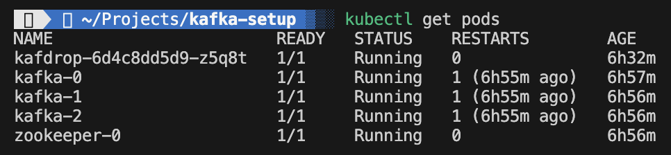
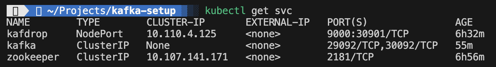
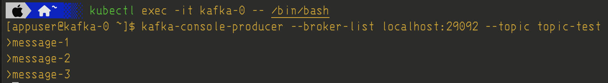
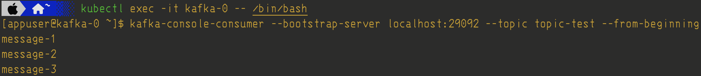
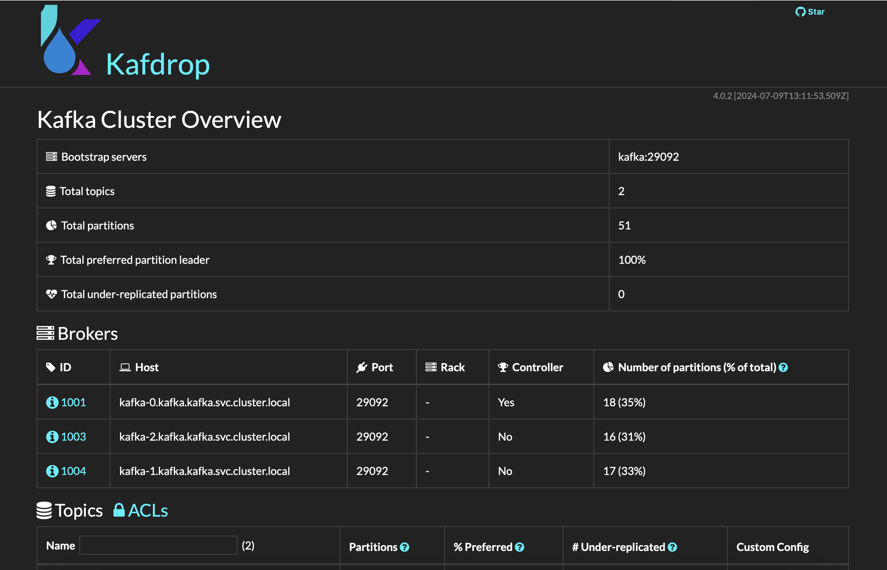

# Setup Apache Kafka on Minikube(Mac)

This repository is for installing an [Apache Kafka](https://kafka.apache.org) cluster with 3 brokers and a Zookeper node on a local [Kubernetes](https://kubernetes.io) cluster. The k8s cluster is running in a minikube container on Docker Desktop.

## Pre-requisites
1. [Docker Desktop](https://docs.docker.com/desktop/install/mac-install/)
2. [Minikube](https://minikube.sigs.k8s.io/docs/start/?arch=%2Fmacos%2Fx86-64%2Fstable%2Fbinary+download)
3. [kubectl](https://kubernetes.io/docs/reference/kubectl/)
4. [HELM](https://helm.sh) (Optional)

Three of the above requirements can be downloaded with the following command if you have brew installed - 
`brew install minikube kubectl helm`

### Installing and running Kafka

1. cd into the project root.
2. Run the `setup.sh` file - 
   `source setup.sh`
3. Check the pods that are running by the following command -
`kubectl get pods`

4. Check the kafka and zookeper services are runing using the following command - 
`kubectl get svc`

5. To test creating a topic, you will have to first enter the pod using - 
   `kubectl exec --stdin --tty [pod-name] -- /bin/sh`
   Then create the topic -
   `kafka-topics --bootstrap-server kafka:29092 --topic [topic-name] --create --partitions [number]`
5. Test producing(sending) message to the kafka topic by entering any one of the kafka pods and sending messages - 

6. Exit out of the container and start a consumer to receive messages from the topic - 
 

### NOTE-
**(CAUTION)** - The following steps will delete you entire installation and you will have to re-perform the above steps.

Sometimes minikube docker container may run out of memory. To prevent this, perform the following steps - 
1. Go to Docker desktop and stop the minikube container.
2. Open a terminal and run the follwoing commands - 
   1. minikube config set memory 8192
   2. minikube delete
   3. minikube start
3. Increase the memory from 8192 to more if it is not enough.
4. Run the steps for installation again.

### (OPTIONAL)
### Install kafdrop 
You can also install Kafdrop for monitoring the topics and messages you produce.

1. Follow the install instructions on Kafdrop readme file-
   [Kafdrop](https://github.com/obsidiandynamics/kafdrop/tree/master?tab=readme-ov-file)
2. If you choose to use HELM for installation, the following command should work - 
`helm upgrade -i kafdrop chart --set image.tag=latest \
--set kafka.brokerConnect=kafka:29092 \
--set server.servlet.contextPath="/" \
--set jvm.opts="-Xms32M -Xmx64M"`
3. In the above command, the port in kafka.brokerConnect is set to 29092 as our kafka service is exposing that port for communications for k8s objects within the cluster. For any communcations outside the cluster or the docker daemon, the port 30092 is used.